# Image Generation with Deep Learning

This project investigates different ways to generate images with deep learning. Currently, the repository includes implementations of two distinct generative modeling approaches: Variational Autoencoders (VAEs) and Diffusion Models. Each approach offers unique strengths in learning image distributions and generating visually coherent outputs.

# 1.  Variational Autoencoders

A Variational Autoencoder is a neural network that combines an encoder and a decoder. The encoder maps an input image into a lower-dimensional latent representation, while the decoder reconstructs the image from that representation. Unlike a standard autoencoder, a VAE does not encode each input to a single point in latent space. Instead, it learns a probability distribution over the latent variables, typically modeled as a Gaussian. This makes the model capable of generating new images by sampling from the latent space rather than simply memorizing training examples.

In this project, the VAE is implemented in [VariationalAutoencoders/model.py](VariationalAutoencoders/model.py) and explored in [VariationalAutoencoders/variational_autoencoder.ipynb](VariationalAutoencoders/variational_autoencoder.ipynb). The goal is to study how well the model can learn meaningful structure from image data and produce visually coherent outputs.

## U-Net Style Architecture

The model uses a convolutional architecture inspired by U-Net principles. The encoder progressively reduces the spatial dimensions of the image while increasing the number of learned feature channels, allowing the network to capture increasingly abstract visual patterns. The decoder then expands these feature maps back to image space, reconstructing the original input through a series of upsampling and convolutional layers.

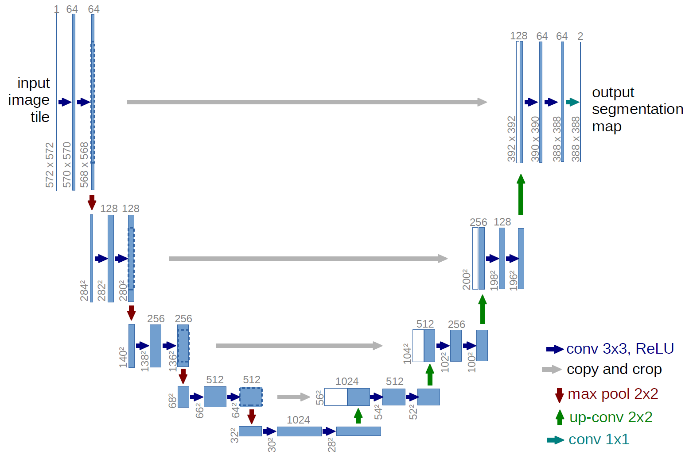

## Generated Samples

  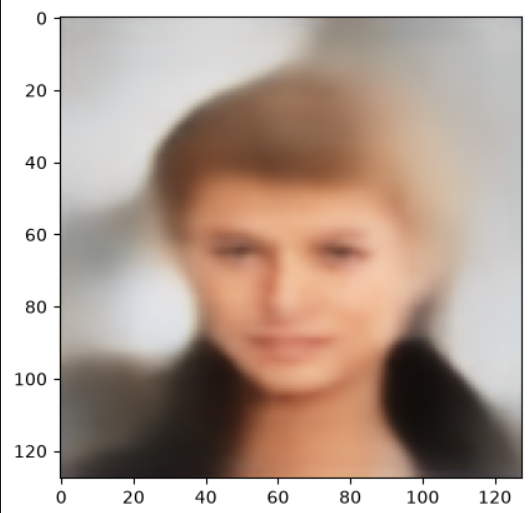
  
  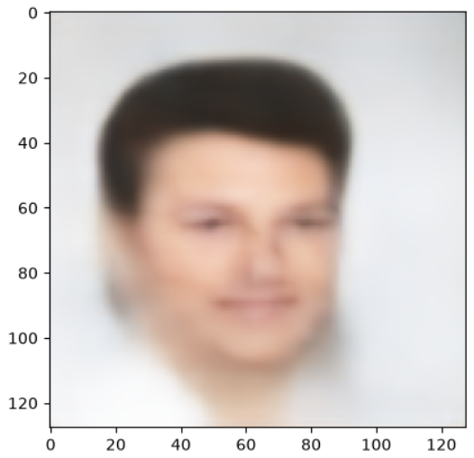
  
  
  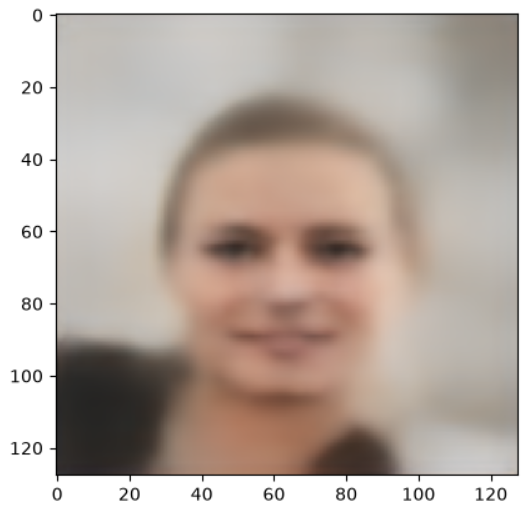
  
  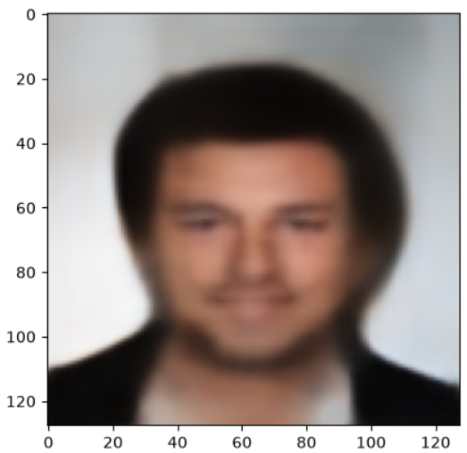
  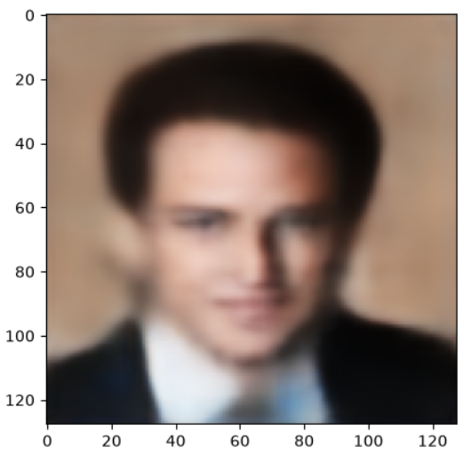

# 2. Diffusion Models

Diffusion Models are a powerful class of generative models that learn to generate images through a reverse diffusion process. The key idea is to gradually transform noise into structured image data. During training, the model learns how to reverse a forward process that progressively adds noise to real images. At generation time, the model starts with random noise and iteratively denoises it, using learned time-conditioned predictions to gradually construct coherent images.

Unlike VAEs, which encode images into a fixed latent representation, diffusion models operate by predicting the noise component at each step of the denoising process. This approach has proven to produce high-quality images and offers greater flexibility in controlling the generation process.

In this project, the Diffusion Model is implemented in [Diffusion/model.py](Diffusion/model.py) and explored in [Diffusion/diffusion.ipynb](Diffusion/diffusion.ipynb). The training workflow is defined in [Diffusion/train.py](Diffusion/train.py).

## Encoder-Decoder with Time Conditioning

The diffusion model architecture uses an encoder-decoder structure similar in spirit to U-Net, but enhanced with time conditioning. The encoder progressively downsamples the input while learning feature representations, and the decoder upsamples back to the original image dimensions. Crucially, both the encoder and decoder blocks incorporate time embeddings that condition the model's behavior based on which step of the diffusion process is currently being performed.

At each denoising step, the model receives a noisy image and a timestep embedding, and predicts the noise component to subtract. This time-aware architecture allows the model to handle the progressive denoising task effectively. Additional components such as group normalization, residual connections, and self-attention blocks help stabilize training and improve the quality of generated images.

## Generated Samples

Several sample images generated by the trained diffusion model are stored in [diffusion_images](diffusion_images). These outputs demonstrate the model's ability to generate face images through the iterative denoising process.

  
  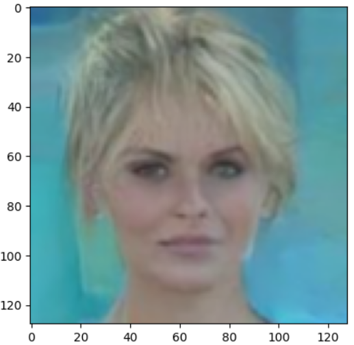
  
  
  
  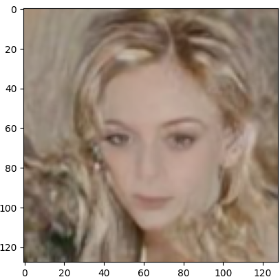
  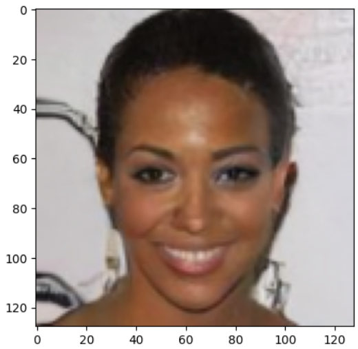
  
  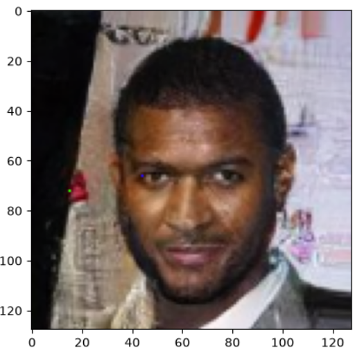
  
  
  
  
  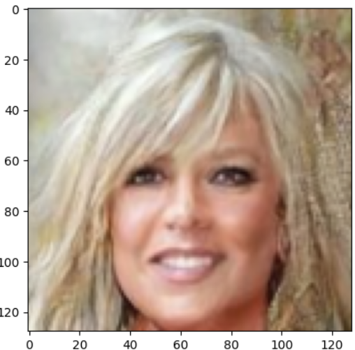
  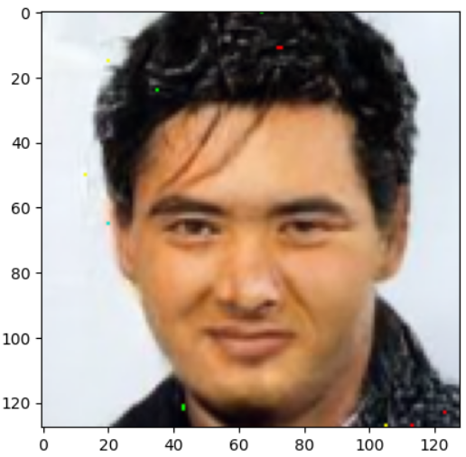

